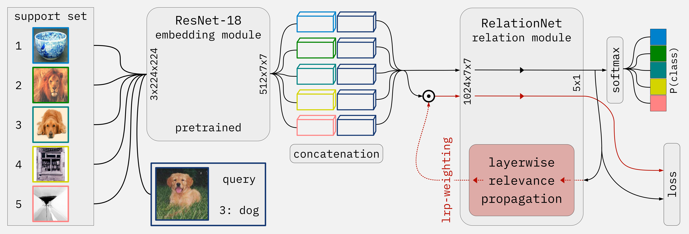

<!-- PROJECT LOGO -->
<br />
<div align="center">
  <a href="https://github.com/github_username/repo_name">
    
  </a>

<h3 align="center">Explanation-Guided Training for Cross-Domain Few-Shot Classification</h3>
</div>


<!-- ABOUT THE PROJECT -->
## About The Project



In this repository we are implementing our own version of the cross-domain fewshot classification model described in:

[Explanation-Guided Training for Cross-Domain Few-Shot Classification](https://arxiv.org/pdf/2007.08790.pdf)

The main idea is to use LRP explanations to guide the training process to improve performance and generalization.


### Built With

[![Pytorch][Pytorch-py]][Pytorch-url]
[![Captum][Captum-py]][Captum-url]
[![Pandas][Pandas-py]][Pandas-url]


<!-- GETTING STARTED -->
## Getting Started
### Installation
Get the project:

```shell
 git clone git@github.com:automl-classroom/project-theinterpreters1.git 
 ```

* Create a conda environment with:
```shell
conda create -n iml_env python=3.11
conda activate iml_env
```

Install the Requirements:

```shell
pip install -r requirements.txt
```

<!-- USAGE EXAMPLES -->
## Usage

If you want to test our project, run:

```shell
python -m pytest
```

If you want to train our models, run (creates training results and models):

```shell
./run.sh 
```


If you want to test the model, run (creates test results for the different models):

```shell 
./run_tests.sh
```

To create our visualizations:

```shell
python visuals.py --result_dirs results/*way*shot*
```

The results from these commands are already included in the repo.


## Which Papers did we use

[Explanation-Guided Training for Cross-Domain Few-Shot Classification](https://arxiv.org/pdf/2007.08790.pdf)

[Layer-Wise Relevance Propagation: An Overview](https://iphome.hhi.de/samek/pdf/MonXAI19.pdf)

[Learning to Compare: Relation Network for Few-Shot Learning](https://arxiv.org/pdf/1711.06025.pdf)

[Deep Residual Learning for Image Recognition](https://arxiv.org/abs/1512.03385)


## Which Datasets did we use

[Plantae](https://www.kaggle.com/c/inaturalist-2021/data)

[Stanford Cars Dataset](https://www.kaggle.com/datasets/jessicali9530/stanford-cars-dataset/data)

[Birds (CUB_200_2011)](https://www.kaggle.com/datasets/xiaojiu1414/cub-200-2011)

[Generated MiniImageNet](https://github.com/yaoyao-liu/mini-imagenet-tools)

[Cifar10](https://www.cs.toronto.edu/%7Ekriz/cifar-10-python.tar.gz)

<!-- MARKDOWN LINKS & IMAGES -->
<!-- https://www.markdownguide.org/basic-syntax/#reference-style-links -->
[Pytorch-py]: https://img.shields.io/badge/Pytorch-B026FF?style=for-the-badge&logo=pytorch&logoColor=white
[Pytorch-url]: https://pytorch.com
[Captum-py]: https://img.shields.io/badge/Captum-097969?style=for-the-badge&logo=pytorch&logoColor=white
[Captum-url]: https://captum.ai
[Pandas-py]: https://img.shields.io/badge/Pandas-FFBF00?style=for-the-badge&logo=pandas&logoColor=white
[Pandas-url]: https://pandas.pydata.org

